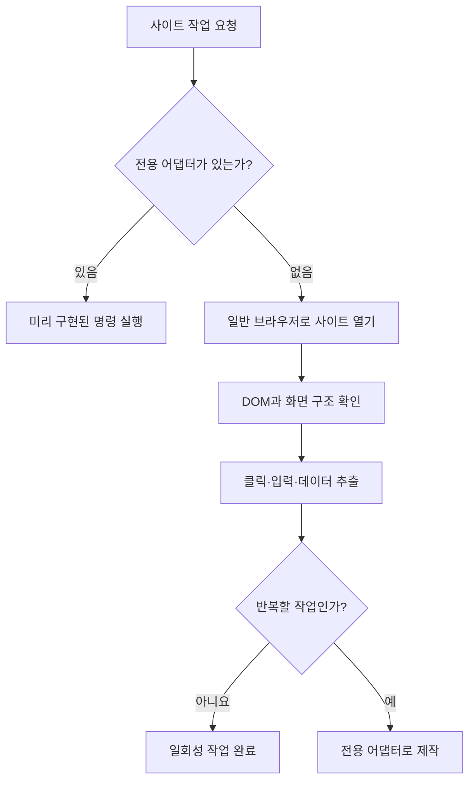
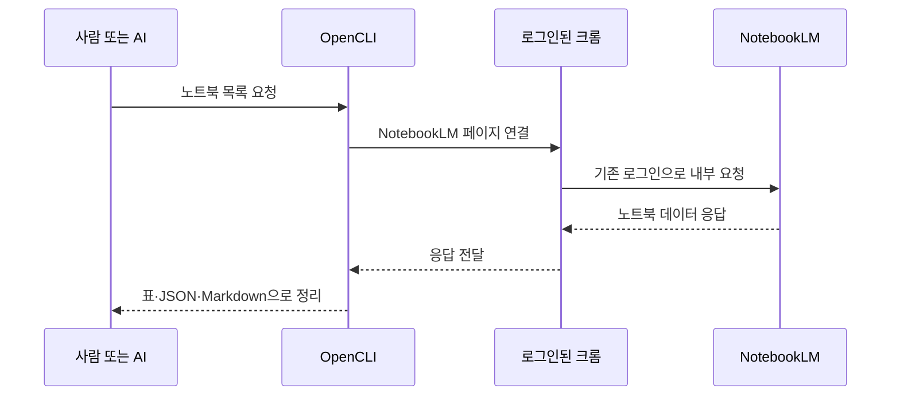

# OpenCLI와 NotebookLM 설치·활용 가이드

> 로그인된 크롬을 CLI에서 활용하는 OpenCLI의 기본 구조와 NotebookLM 연동 방법을 쉽게 설명한다.

---

## 0. 먼저 결론

OpenCLI는 웹사이트를 터미널 명령으로 다루게 해주는 도구다.

핵심 특징은 다음과 같다.

- 별도 계정이나 API 키 대신 **현재 크롬의 로그인 상태**를 활용할 수 있다.
- 지원 사이트에는 미리 만들어진 전용 명령을 사용한다.
- 처음 보는 사이트는 일반 브라우저 명령으로 화면을 탐색하고 조작한다.
- 반복하는 작업은 새로운 전용 명령으로 만들어 재사용할 수 있다.
- NotebookLM에서는 노트북과 소스를 읽을 수 있고, 노트북·소스·노트 생성도 지원한다.

OpenCLI가 사이트의 내용을 스스로 이해하는 AI는 아니다. OpenCLI는 브라우저와 사이트의 데이터를 연결하고, 실제 의미 판단과 작업 순서 결정은 사람이나 AI 에이전트가 담당한다.

---

## 1. OpenCLI가 하는 일

일반적인 브라우저 작업은 사람이 화면을 보고 버튼을 누른다. OpenCLI는 이 과정을 명령으로 바꾼다.

```text
사람 또는 AI 에이전트
        ↓ 명령
      OpenCLI
        ↓
크롬 확장 프로그램과 로컬 데몬
        ↓
로그인된 실제 크롬
        ↓
웹사이트 화면·내부 데이터
```

예를 들어 NotebookLM 노트북 목록을 가져올 때 다음과 같이 실행한다.

```bash
opencli notebooklm list
```

결과는 표뿐 아니라 JSON, YAML, Markdown, CSV로도 받을 수 있다.

```bash
opencli notebooklm list -f json
opencli notebooklm list -f md
```

### 전용 명령과 일반 브라우저 명령

| 구분 | 사용 상황 | 특징 |
|---|---|---|
| 사이트 전용 명령 | OpenCLI가 이미 지원하는 사이트 | 빠르고 결과 형식이 일정함 |
| 일반 브라우저 명령 | 전용 명령이 없는 사이트 | 실제 화면을 읽고 클릭·입력함 |

NotebookLM의 `list`, `source-list`, `source-fulltext` 등은 미리 구현된 전용 명령이다.

---

## 2. 설치 방법

이 문서는 다음 환경에서 확인했다.

- 확인일: 2026-07-18
- OpenCLI: `1.8.6`
- 운영체제: macOS
- 브라우저: Google Chrome

### 2.1 Node.js 확인

npm 방식으로 설치하려면 Node.js 20 이상이 필요하다.

```bash
node --version
```

### 2.2 OpenCLI 설치

```bash
npm install -g @jackwener/opencli
```

설치 확인:

```bash
opencli --version
```

### 2.3 크롬 확장 프로그램 설치

OpenCLI는 크롬 확장 프로그램을 통해 브라우저와 연결된다.

1. Chrome 웹 스토어에서 OpenCLI 확장 프로그램을 설치한다.
2. 확장 프로그램을 활성화한다.
3. 사용할 크롬 프로필에서 NotebookLM에 로그인한다.

### 2.4 연결 상태 확인

```bash
opencli doctor
```

정상이라면 OpenCLI, 로컬 데몬, 크롬 확장 프로그램의 연결 상태를 확인할 수 있다.

---

## 3. 크롬 프로필 사용 방식

OpenCLI는 별도의 헤드리스 브라우저를 새로 실행하는 방식이 아니다. 확장 프로그램이 활성화된 **실제 크롬 프로필**을 사용한다.

따라서 다음 상태를 그대로 활용할 수 있다.

- Google 로그인
- NotebookLM 로그인
- 해당 계정이 접근할 수 있는 노트북
- 사이트에 저장된 로그인 세션

OpenCLI가 작업용 탭을 백그라운드에서 열 수 있지만, 사용자가 보고 있던 현재 탭을 반드시 차지하는 것은 아니다.

### 프로필 확인

```bash
opencli profile list
```

크롬 프로필이 여러 개라면 알아보기 쉬운 별칭을 붙일 수 있다.

```bash
opencli profile rename <프로필-ID> work
opencli profile use work
```

특정 명령에서만 프로필을 지정할 수도 있다.

```bash
opencli --profile work notebooklm status
```

> 프로필 ID와 Google 계정 정보는 개인 환경 정보이므로 공개 문서나 로그에 그대로 남기지 않는 것이 좋다.

---

## 4. 어떤 사이트를 지원하는가

OpenCLI `1.8.6` 설치본에는 173개 사이트·앱 이름 공간과 1,275개 명령이 등록돼 있다. 숫자는 버전에 따라 달라질 수 있다.

대표적인 지원 대상은 다음과 같다.

| 분야 | 예시 |
|---|---|
| AI | ChatGPT, Claude, Gemini, NotebookLM, Grok, DeepSeek |
| 개발 | GitHub, Stack Overflow, MDN, npm, PyPI, Docker Hub |
| 논문·지식 | arXiv, PubMed, Google Scholar, Wikipedia |
| 소셜 | X/Twitter, Reddit, LinkedIn, Facebook, Instagram |
| 영상·음성 | YouTube, Spotify, Apple Podcasts, TikTok |
| 쇼핑·여행 | Amazon, Coupang, Taobao, Booking.com, Ctrip |
| 금융 | Binance, CoinGecko, Yahoo Finance, Bloomberg |
| 협업 | Jira, Confluence |
| 데스크톱 앱 | Cursor, Codex, ChatGPT 앱, ChatWise |

지원 사이트 목록은 다음 명령으로 확인한다.

```bash
opencli list
```

사이트별 명령은 도움말로 확인한다.

```bash
opencli notebooklm --help
opencli github --help
opencli youtube --help
```

> 사이트가 목록에 있다고 해서 그 사이트의 모든 기능을 지원하는 것은 아니다. 도움말에 표시된 명령만 전용 기능으로 지원한다.

---

## 5. 처음 보는 사이트는 어떻게 처리하는가

전용 명령이 없는 사이트에서는 `opencli browser` 기능을 사용한다.



일반 브라우저 모드에서 주로 사용하는 기능은 다음과 같다.

| 기능 | 설명 |
|---|---|
| `open` | 사이트 열기 |
| `state` | 화면의 DOM과 접근성 구조 읽기 |
| `find` | 버튼·링크·입력창 찾기 |
| `click` | 버튼이나 링크 클릭 |
| `fill`, `type` | 입력창에 내용 작성 |
| `select` | 선택 항목 변경 |
| `network` | 페이지의 네트워크 요청 확인 |
| `extract` | 화면 데이터를 구조화하여 추출 |
| `wait` | 화면 전환이나 응답 기다리기 |

OpenCLI 혼자서 처음 보는 사이트의 의미를 자동으로 이해하는 것은 아니다. 사람이나 AI 에이전트가 현재 화면 구조를 읽고 필요한 작업 순서를 결정한다.

같은 작업을 자주 반복한다면 조사한 절차를 전용 명령으로 만들 수 있다.

```text
처음 보는 사이트 탐색
  → 안정적인 화면 요소 또는 데이터 요청 확인
  → 입력값과 출력값 정의
  → 전용 어댑터 작성
  → 실제 사이트에서 검증
  → 짧은 CLI 명령으로 재사용
```

---

## 6. NotebookLM에서 할 수 있는 일

### 6.1 읽기 기능

| 목적 | 명령 |
|---|---|
| 로그인 상태 확인 | `notebooklm status` |
| 현재 계정 확인 | `notebooklm whoami` |
| 노트북 목록 | `notebooklm list` |
| 노트북 열기 | `notebooklm open` |
| 현재 노트북 확인 | `notebooklm current` |
| 노트북 상세정보 | `notebooklm get` |
| 노트북 요약 | `notebooklm summary` |
| 소스 목록 | `notebooklm source-list` |
| 소스 상세정보 | `notebooklm source-get` |
| 소스 추출 전문 | `notebooklm source-fulltext` |
| 소스 가이드 | `notebooklm source-guide` |
| 대화 기록 | `notebooklm history` |
| 저장된 노트 | `notebooklm note-list`, `notes-get` |

로그인이 필요하면 다음 명령으로 NotebookLM 로그인 화면을 열고, 사용자가 인증을 마칠 때까지 기다릴 수 있다.

```bash
opencli notebooklm login
```

이 명령은 브라우저의 로그인 상태에 영향을 주기 때문에 `write`로 분류되지만, NotebookLM 노트북이나 소스를 생성하는 명령은 아니다.

기본적인 읽기 흐름은 다음과 같다.

```bash
# 로그인 상태
opencli notebooklm status

# 노트북 목록
opencli notebooklm list -f json

# 노트북 열기
opencli notebooklm open <노트북-ID>

# 소스 목록
opencli notebooklm source-list

# 특정 소스의 추출 전문
opencli notebooklm source-fulltext <소스-ID> -f json
```

`source-fulltext`는 OpenCLI가 음성을 직접 인식하는 기능이 아니다. NotebookLM이 이미 음성이나 문서에서 추출한 텍스트를 가져오는 기능이다.

### 6.2 쓰기 기능

NotebookLM 쓰기 명령도 OpenCLI에 미리 구현돼 있다. AI가 화면을 보고 즉석에서 발견한 기능이 아니다.

| 목적 | 명령 |
|---|---|
| 새 노트북 생성 | `notebooklm create` |
| URL·텍스트·파일 소스 추가 | `notebooklm add-source` |
| Studio 노트 생성 | `notebooklm write-note` |
| 오디오 개요 생성 요청 | `notebooklm generate-audio` |
| 슬라이드 생성 요청 | `notebooklm generate-slides` |

실제 쓰기에는 `--execute`가 필요하다.

```bash
# 새 노트북 생성
opencli notebooklm create "테스트 노트북" --execute

# URL 소스 추가
opencli notebooklm add-source <노트북-ID> \
  --url "https://example.com" \
  --execute

# 로컬 파일 추가
opencli notebooklm add-source <노트북-ID> \
  --file "/경로/문서.pdf" \
  --execute

# Markdown 노트 생성
opencli notebooklm write-note <노트북-ID> \
  --title "분석 결과" \
  --content "## 핵심 내용" \
  --execute
```

OpenCLI `1.8.6`의 NotebookLM 전용 명령에는 다음 기능이 없다.

- 노트북 삭제 또는 제목 변경
- 기존 소스 삭제·교체
- 기존 노트 수정·삭제
- NotebookLM 채팅창에 질문 전송
- 생성된 오디오·슬라이드 다운로드

이 기능이 필요하면 버전 업데이트 여부를 확인하거나 일반 브라우저 조작을 검토해야 한다.

---

## 7. OpenCLI가 NotebookLM을 처리하는 원리

OpenCLI에는 NotebookLM의 주소 형식, 내부 요청, 응답 구조를 알고 있는 전용 어댑터가 포함돼 있다.



처리 순서는 다음과 같다.

1. 크롬에서 NotebookLM 로그인 상태를 확인한다.
2. 페이지에 있는 인증 정보를 사용해 NotebookLM 내부 요청을 보낸다.
3. 반환된 데이터를 노트북·소스·전사문 형태로 해석한다.
4. JSON이나 표처럼 다루기 쉬운 형식으로 출력한다.
5. 내부 요청이 실패하면 일부 명령은 화면 DOM을 읽는 방식으로 대체한다.

역할을 구분하면 다음과 같다.

| 구성 요소 | 역할 |
|---|---|
| 크롬 | 로그인 상태와 실제 페이지 제공 |
| OpenCLI | 사이트 데이터 조회와 명령 실행 |
| NotebookLM | 업로드 소스의 전사·요약·생성 처리 |
| 사람 또는 AI | 결과의 의미 해석과 다음 작업 결정 |

---

## 8. 실제 확인한 범위

개인정보를 제외한 실제 검증 결과는 다음과 같다.

- 크롬 확장 프로그램과 OpenCLI 연결 성공
- 기존 크롬 프로필의 Google 로그인 상태 사용 성공
- NotebookLM 로그인 계정 확인 성공
- 노트북 목록 조회 성공
- 지정한 노트북 열기 성공
- 노트북의 소스 목록 조회 성공
- 오디오 소스에서 NotebookLM이 추출한 전사문 조회 성공
- NotebookLM 요약과 소스 전문을 각각 구분하여 조회 성공

검증 과정에서는 읽기 명령만 사용했으며 노트북, 소스, 노트는 변경하지 않았다.

---

## 9. 안전하게 사용하는 방법

### 읽기와 쓰기를 구분한다

명령 도움말에는 접근 유형이 표시된다.

```text
access: read
access: write
```

NotebookLM 전용 쓰기 명령은 `--execute`가 없으면 실제 변경을 거부한다.

반면 일반 브라우저 모드의 `click`과 `fill`은 실제 사이트를 직접 조작한다. 결제, 전송, 삭제, 게시, 설정 변경처럼 중요한 작업은 실행 전에 대상을 다시 확인해야 한다.

### 민감정보를 출력하지 않는다

- 프로필 ID와 계정 정보는 공개 문서에 기록하지 않는다.
- 노트북 UUID와 개인 노트북 제목을 공유하지 않는다.
- 쿠키와 인증 토큰을 로그에 남기지 않는다.
- 개인 문서의 전사문을 공개 저장소에 저장하지 않는다.
- `--verbose`와 `--trace` 결과를 공유하기 전에 민감정보를 확인한다.

### 인증을 우회하지 않는다

OpenCLI는 기존 계정 권한 안에서만 동작한다. 로그인, OTP, 캡차, 접근승인 화면을 자동으로 우회하는 도구가 아니다.

---

## 10. 처음 시험해보기 좋은 순서

처음부터 쓰기 기능을 사용하기보다 읽기 명령으로 연결 상태를 확인하는 것이 좋다.

```text
1. opencli doctor
2. opencli profile list
3. opencli notebooklm status
4. opencli notebooklm whoami
5. opencli notebooklm list
6. 테스트 노트북 open
7. source-list
8. source-fulltext
9. 필요한 경우에만 쓰기 명령과 --execute 사용
```

가장 간단한 시험 명령은 다음과 같다.

```bash
opencli notebooklm status
opencli notebooklm list -f json | jq '.[0:5]'
```

---

## 11. 문제 해결

### 확장 프로그램이 연결되지 않을 때

```bash
opencli doctor
opencli profile list
```

- 크롬이 실행 중인지 확인한다.
- OpenCLI 확장 프로그램이 활성화돼 있는지 확인한다.
- 사용할 크롬 프로필에서 확장 프로그램이 설치됐는지 확인한다.

### 로그인 오류가 날 때

- 같은 크롬 프로필에서 NotebookLM을 직접 연다.
- Google 로그인이 유지되는지 확인한다.
- 계정 선택이나 추가 인증이 필요하면 브라우저에서 직접 완료한다.

### 노트북이나 소스를 찾지 못할 때

```bash
opencli notebooklm list -f json
opencli notebooklm open <노트북-ID>
opencli notebooklm source-list -f json
```

제목보다 UUID를 사용하면 동명이거나 비슷한 제목으로 인한 혼동을 줄일 수 있다.

### 명령이 갑자기 실패할 때

NotebookLM 내부 요청은 공식 공개 API가 아니다. Google이 사이트 구조나 내부 요청 형식을 변경하면 어댑터 업데이트가 필요할 수 있다.

```bash
npm install -g @jackwener/opencli@latest
opencli doctor
```

---

## 12. 참고자료

- [OpenCLI 공식 GitHub](https://github.com/jackwener/OpenCLI)
- [OpenCLI 공식 문서](https://opencli.info/)
- [OpenCLI 지원 어댑터 목록](https://opencli.info/docs/adapters/)
- [OpenCLI npm 패키지](https://www.npmjs.com/package/@jackwener/opencli)
