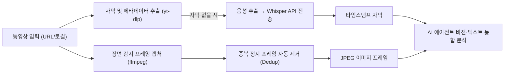

# Claude Video (/watch) 동영상 분석 가이드

> 작성일: 2026-08-17  
> 도구: `bradautomates/claude-video`  
> 초점: **AI 에이전트에 동영상 시각·음성 분석 능력을 부여하는 핵심 기능 및 실무 사용법**

---

## 목차

1. [개요 및 동작 원리](#1-개요-및-동작-원리)
2. [핵심 기능 요약](#2-핵심-기능-요약)
3. [설치 및 환경 설정](#3-설치-및-환경-설정)
4. [기본 사용법 (Quick Guide)](#4-기본-사용법-quick-guide)
5. [주요 옵션 및 토큰 절약 전략](#5-주요-옵션-및-토큰-절약-전략)
6. [지원 환경 (Claude Code, Codex, IDE)](#6-지원-환경-claude-code-codex-ide)
7. [실무 활용 예시 모음](#7-실무-활용-예시-모음)
8. [출처 및 참고 링크](#8-출처-및-참고-링크)

---

## 1. 개요 및 동작 원리

**Claude Video**는 AI 에이전트(Claude Code, Codex CLI, Cursor 등)가 동영상을 **직접 보고 들을 수 있도록** 해주는 오픈소스 플러그인/스킬입니다.

기존에는 AI에 영상 링크를 입력하면 제목·설명란만 읽고 추측하거나 자막 텍스트만 훑어 화면 속 실제 내용(코드, UI 에러, 차트, 시연 등)을 알 수 없었습니다. `/watch`는 다음 파이프라인을 통해 사람이 영상을 보듯 정확하게 분석합니다:



---

## 2. 핵심 기능 요약

* **광범위한 영상 소스 지원**: YouTube, Vimeo, TikTok, X(Twitter), Loom 등 수백 개 웹사이트의 URL 및 로컬 파일(`.mp4`, `.mov`, `.mkv`, `.webm`) 지원
* **장면 인지 프레임 추출**: 단순 일정한 시간 간격이 아닌, 화면이 바뀌는 **장면 전환(Scene Change)**을 감지하여 핵심 이미지만 선별
* **중복 프레임 제거 (Dedup)**: 슬라이드나 고정 화면처럼 동일한 이미지가 반복될 경우 자동으로 제거하여 이미지 토큰 비용을 최소화
* **무료 기본 자막 + Whisper AI 폴백**: YouTube 등 기본 자막이 있는 경우 완전 무료로 추출하며, 자막이 없는 영상은 Groq/OpenAI Whisper API를 통해 타임스탬프 자막 자동 생성

---

## 3. 설치 및 환경 설정

### 1) 시스템 필수 도구 (Homebrew)
```bash
brew install ffmpeg yt-dlp
```

### 2) 플러그인 및 스킬 설치

#### Claude Code 플러그인으로 설치
```bash
/plugin marketplace add bradautomates/claude-video
/plugin install watch@claude-video
```

#### Agent Skills (전역 설치 — Codex, Cursor, Antigravity 등 공통)
```bash
npx skills add bradautomates/claude-video -g
```

### 3) 설정 파일 (`~/.config/watch/.env`)
기본 자막이 있는 일반 영상 분석은 **API 키 없이 즉시 동작**합니다. 자막 없는 로컬 영상/SNS 영상의 음성 텍스트화가 필요할 때만 키를 등록합니다.

```env
# Whisper 음성 변환용 API 키 (선택 사항)
GROQ_API_KEY=        # 권장: 빠르고 저렴 (console.groq.com)
OPENAI_API_KEY=      # 대체 키 (platform.openai.com)

# 기본 캡처 디테일 모드 (기본값: balanced)
WATCH_DETAIL=balanced
SETUP_COMPLETE=true
```

---

## 4. 기본 사용법 (Quick Guide)

Claude Code나 Codex CLI 대화창에서 `/watch` 명령어로 바로 실행합니다.

```bash
# 1. 유튜브 / 웹 영상 전체 요약
/watch https://youtu.be/dQw4w9WgXcQ 전체적인 핵심 내용을 요약해줘

# 2. 특정 시점 화면 분석
/watch https://youtu.be/dQw4w9WgXcQ 1분 30초 부근에 화면에 나오는 코드가 뭐야?

# 3. 로컬 화면 녹화본(버그 재현 등) 진단
/watch ~/Downloads/bug-repro.mov UI가 깨지는 순간과 원인을 분석해줘
```

---

## 5. 주요 옵션 및 토큰 절약 전략

이미지 프레임은 컨텍스트 토큰을 많이 소모하므로 목적에 맞는 옵션을 조합하면 비용과 속도를 크게 최적화할 수 있습니다.

### ① 특정 구간 집중 분석 (`--start`, `--end`)
영상 전체를 듬성듬성 스캔하는 대신, 관심 있는 구간만 지정하여 고밀도(초당 최대 2프레임)로 정밀하게 분석합니다.

```bash
# 2분 15초 ~ 2분 45초 구간만 집중 분석
/watch https://youtu.be/abc --start 2:15 --end 2:45

# 1시간 12분부터 끝까지 분석
/watch https://youtu.be/abc --start 1:12:00
```

### ② 디테일 모드 (`--detail`)

| 모드 | 동작 방식 | 프레임 한도 | 추천 용도 |
| :--- | :--- | :---: | :--- |
| `transcript` | 영상 다운로드/이미지 없이 **자막 텍스트만** 읽음 | 0장 | 초고속 내용 요약 (가장 저렴) |
| `efficient` | 키프레임 위주로 빠른 캡처 | 최대 50장 | 빠른 흐름 파악 |
| `balanced` | **(기본값)** 장면 전환 감지 프레임 캡처 | 최대 100장 | 일반적인 동영상 분석 |
| `token-burner` | 모든 장면 전환 프레임을 무제한 캡처 | 무제한 | 세밀한 시각적 디테일 분석 |

### ③ 작은 텍스트/코드 판독 (`--resolution`)
기본 캡처 해상도는 가로 512px입니다. 슬라이드 글씨나 터미널 코드가 작아서 판독이 어려울 경우 1024px로 확장합니다.

```bash
/watch https://youtu.be/abc --resolution 1024
```

---

## 6. 지원 환경 (Claude Code, Codex, IDE)

* **Claude Code (`claude`)**: `/watch` 슬래시 커맨드로 호출
* **Codex CLI (`codex`)**: `/watch` 명령어 또는 자연어 프롬프트("watch 스킬로 영상 분석해줘")로 호출
* **Cursor / Windsurf / Antigravity**: Agent Skills 표준 경로(`~/.agents/skills/watch`)를 통해 자동 인식
* **터미널 독립 CLI**: AI 에이전트 없이 터미널에서 스크립트 단독 실행 가능
  ```bash
  python3 ~/.agents/skills/watch/scripts/watch.py "https://youtu.be/xxx"
  ```

---

## 7. 실무 활용 예시 모음

### A. 버그 재현 영상 분석
```text
/watch ~/Downloads/issue-repro.mov
어떤 입력 이후에 예외 화면이 나타나는지 타임스탬프와 함께 정리해줘
```

### B. 기술 세미나 / 콘퍼런스 발표 요약
```text
/watch https://youtu.be/conference-talk --detail transcript
발표자가 제안하는 새로운 아키텍처 패턴의 핵심 포인트 3가지를 정리해줘
```

### C. 신규 라이브러리 데모 영상 코드 추출
```text
/watch https://youtu.be/lib-demo --start 3:00 --end 4:30 --resolution 1024
화면에 나오는 설정 파일 작성 예시 코드를 마크다운 코드 블록으로 추출해줘
```

---

## 8. 출처 및 참고 링크

* [GitHub 저장소 — bradautomates/claude-video](https://github.com/bradautomates/claude-video)
* [Agent Skills 명세 — agentskills.io](https://agentskills.io)
